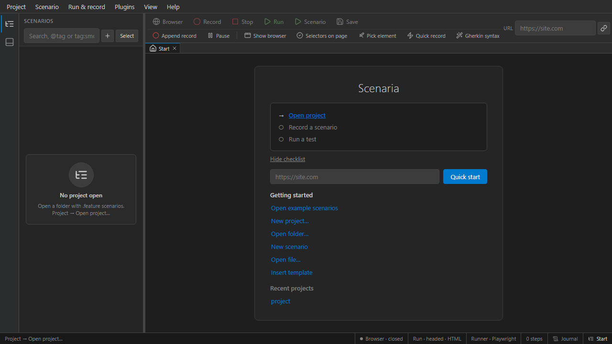

# First project

## Open bundled examples

Fastest way to explore Scenaria without creating files:



1. Launch **scenaria-gui.exe**
2. **Start** tab → **Open example scenarios**
3. The left **Catalog** lists `.feature` files under `examples/`
4. Double-click a file to open the editor

See [Examples](../authoring/examples.md) for file descriptions.

## Create a new project

**Start** → **New project…** (wizard):

| Step | Action |
|------|--------|
| Folder | Choose or create an empty directory |
| Init | Optionally create `.scenaria/` scaffold (`scenaria init`) |
| Sample | Optionally add a starter `.feature` file |

Or manually:

```bash
mkdir my-tests && cd my-tests
scenaria init .
```

This creates `.scenaria/` with `project.json`, default settings, and folders for artifacts.

## Open an existing folder

**Project → Open project…** and select a directory containing `.feature` files (with or without `.scenaria/`).

Scenaria remembers recent projects on the **Start** tab.

## Project layout

```
my-project/
  login.feature
  smoke.feature
  .scenaria/
    project.json       # browser, base URL, plugins
    settings.json      # IDE preferences
    test_clients/      # saved browser sessions (TestClient)
    allure-results/    # after runs with Allure enabled
    traces/ videos/    # optional artifacts
```

## Initialize in IDE

**Project → Initialize Scenaria…** adds `.scenaria/` to the current folder without overwriting scenarios.

## CLI equivalent

```bash
scenaria init /path/to/project
scenaria validate /path/to/project
scenaria run /path/to/project --dry-run
```

## Next

- [Onboarding tour](onboarding.md) — guided UI walkthrough
- [Editor](../gui/editor.md) — write scenarios
- [Recording](../gui/recording.md) — capture steps from the browser
