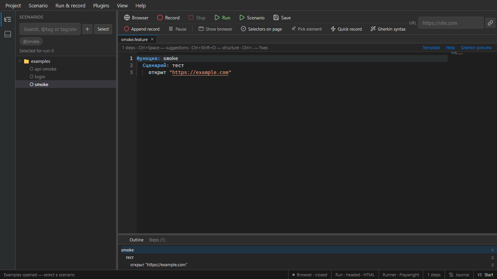

# Editor

Scenaria uses **Monaco** with a custom `scenaria-feature` language for Russian Gherkin.

## Tabs and files

- Each `.feature` opens in a tab; unsaved changes show a dot on the tab
- **New scenario** creates an untitled tab from a template
- Closing a dirty tab prompts to save
- Session restore reopens tabs and cursor position after restart

## Completions and snippets

| Shortcut | Action |
|----------|--------|
| **Ctrl+Space** | Step completions at cursor line |
| **Snippet palette** | Insert catalog steps from menu / palette |

Completions respect scenario context (inside `Если`, table rows, etc.).

## Step help

- **Hover** on a step line — short hint and error marker
- **F1** / **Help → Reference…** — full step catalog by category
- **Inlay hints** — compact warnings on problematic lines

## Formatting and navigation

| Shortcut | Action |
|----------|--------|
| Shift+Alt+F | Format document |
| Ctrl+Shift+O | Go to symbol (scenarios, rules) |
| Ctrl+F / Ctrl+H | Find / replace |
| Folding | Collapse `Если`, `Повторяю`, `Пока`, `Для каждого` blocks |

**Format on save** — optional in **Settings → Editor**.

## Preview pane

**View → Preview** shows a read-only rendered view of the current feature (updates with debounce). Large files (≥2000 lines) disable minimap, code lens, and inlay hints for performance.

## Scenario hints

On save or validate, Scenaria may suggest fixes (unknown steps, indentation). Auto-fix options are in settings.

## Code lens

Run actions above scenario lines: run scenario, dry-run, run to line (partial run).

## Related

- [Gherkin authoring](../authoring/gherkin.md)
- [Selectors](../authoring/selectors.md)
- [Running tests](running-tests.md)
