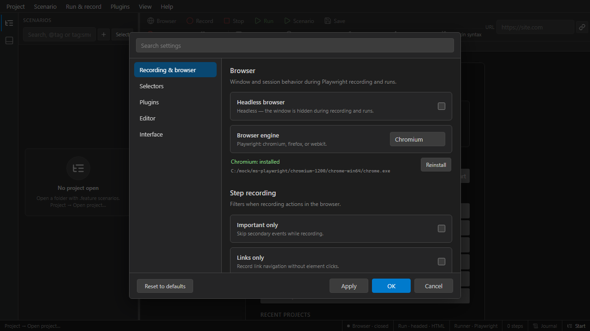

# Settings

**File → Settings…** (or command palette). Tabs:

## Interface (UI)

- Theme: system / light / dark
- Toolbar compact mode, sidebar width
- Bottom panel height, steps panel
- Preview pane visibility
- Check for updates on startup

**Apply** keeps dialog open; **OK** saves and closes. **Reset to defaults** restores factory values (with confirmation for extreme workers/slow-mo).

## Editor

- Font size, tab size, word wrap
- Minimap, line numbers, bracket pairs
- Format on save
- Inlay hints, code lens
- Large-file thresholds

## Recording

- Default idle timeout, filter options
- Selector strategy preferences
- Auto-normalize recorded steps

## Selectors

- Default validation browser
- Navigation wait (`domcontentloaded` vs `load`)
- Retry policy defaults

## Plugins

- Plugin directories, enabled list
- Install / remove plugin packages

Settings persist in `.scenaria/settings.json` (per project) and user profile for global IDE preferences.

## Related

- [Recording](recording.md)
- [Running tests](running-tests.md)
- [Selectors](../authoring/selectors.md)
