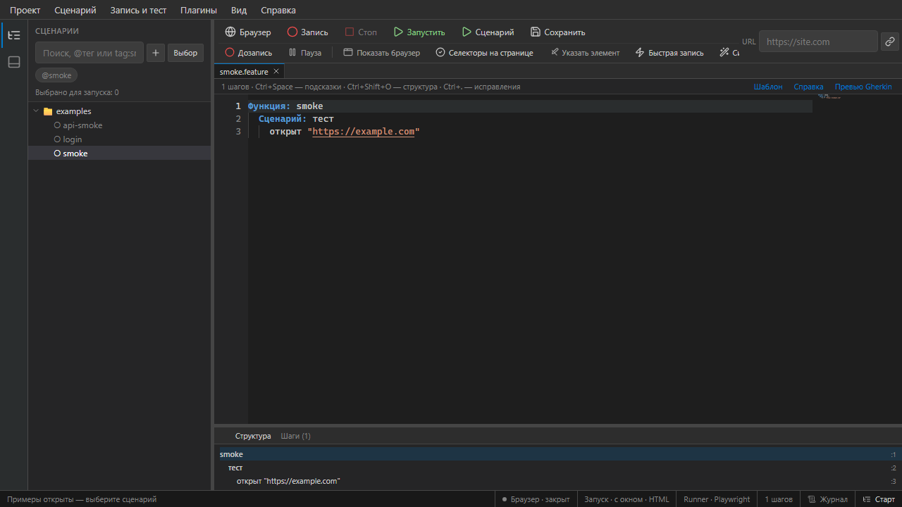
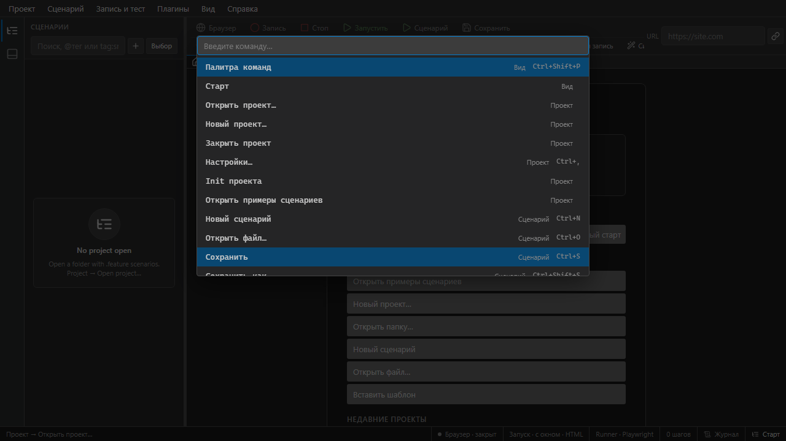

# Обзор интерфейса

IDE Scenaria — однооконное приложение (Wails + WebView2) в стиле редактора кода.

## Основные области

*Меню, каталог сценариев, редактор Monaco, нижняя панель и строка состояния.*

| Область | Назначение |
|---------|------------|
| **«Старт»** | Приветствие, недавние проекты, примеры, новый проект |
| **Каталог** | Дерево `.feature`, теги, бейджи прогонов, пакетный выбор |
| **Редактор** | Сценарии Gherkin с подсветкой |
| **Нижняя панель** | Журнал, результаты, ошибки проверки |
| **Строка состояния** | Текущая операция, ссылка на журнал |

## Меню

| Меню | Частые действия |
|------|-----------------|
| **Проект** | Открыть, закрыть, init, новый сценарий |
| **Запуск** | Запустить…, Dry-run, Проверить…, по тегу… |
| **Запись** | Начать запись…, TestClient…, инструменты браузера |
| **Вид** | Каталог, журнал (Ctrl+`), превью |
| **Справка** | F1, Обучение…, О программе |

## Палитра команд

**Ctrl+Shift+P** — поиск по ~80 командам.

## Панель браузера

При открытом браузере, записи или тесте — плавающая панель: фокус, пауза, стоп, picker, проверка селекторов, headless.

## Горячие клавиши

| Сочетание | Действие |
|-----------|----------|
| Ctrl+S | Сохранить |
| Ctrl+Enter | Запуск / диалог запуска |
| Ctrl+Shift+R | Стоп теста или записи |
| Ctrl+B | Открыть браузер |
| Ctrl+` | Нижняя панель / журнал |
| Ctrl+Shift+P | Палитра команд |
| F1 | Справка по шагам |
| Shift+F1 | Все горячие клавиши |

## См. также

- [Редактор](editor.md)
- [Запись](recording.md)
- [Запуск тестов](running-tests.md)
- [Настройки](settings.md)
